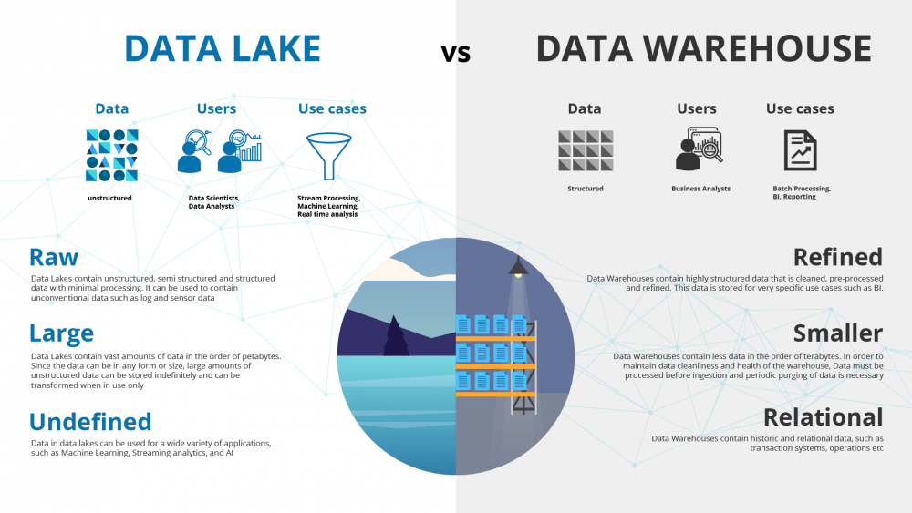
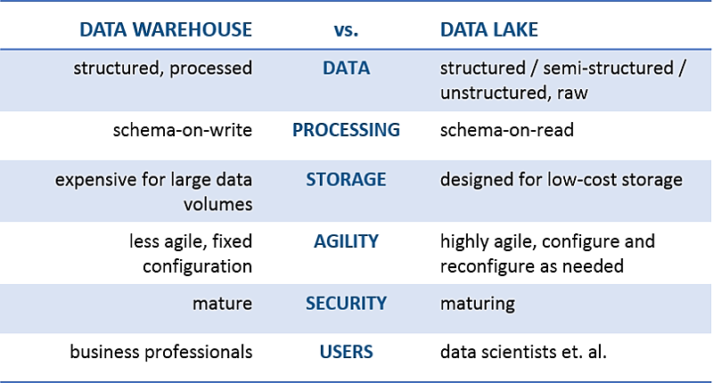
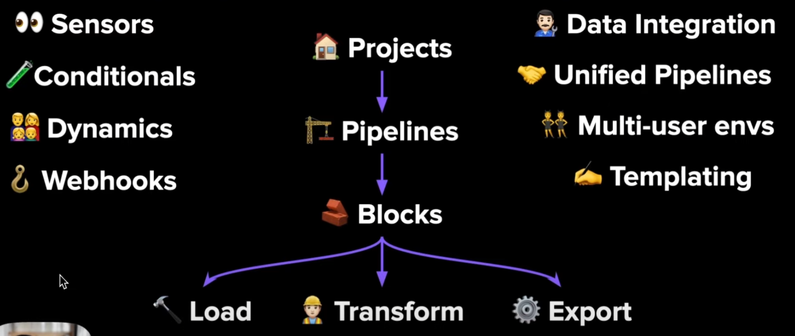
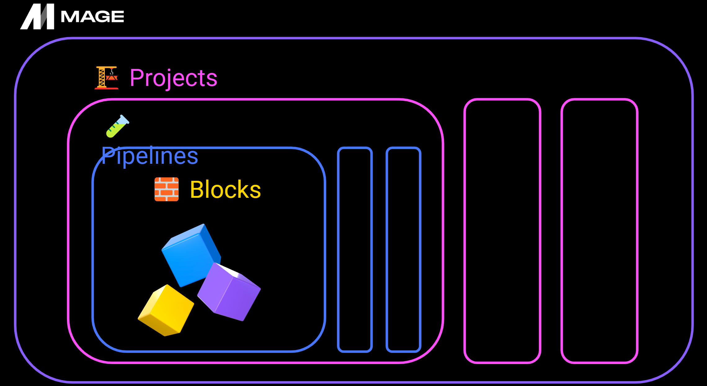
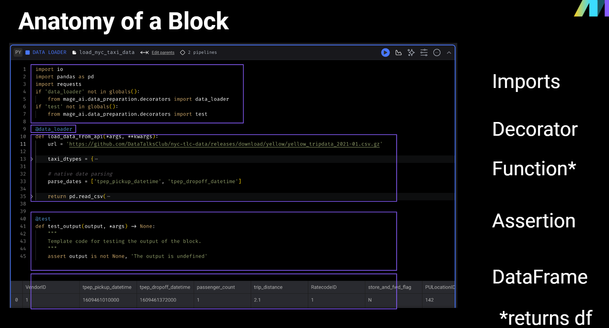
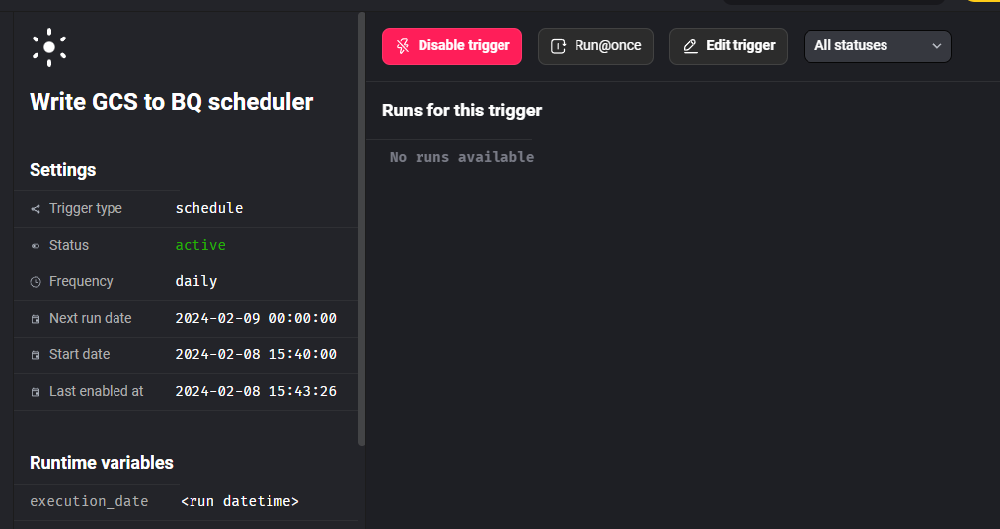
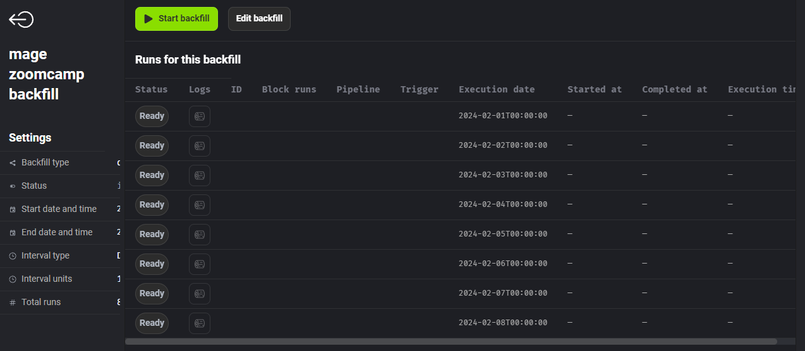

# Week 2 - Workflow Orchestration

### Table of contents

1. [Basic definitions](#part-1)
2. [Basic Workflow orchestration with Mage](#part-2)
3. [ETL with GCP & Prefect](#part-3)
4. [From Google Cloud Storage to BigQuery](#part-4)
5. [Parameterization and Deployments](#part-5)
6. [Scheduling and Containerization](#part-6)  

    [Additional resources](#resource)

## Part 1: Basic Definitions <a id='part-1'></a> (from 2023 cohort)

### Data Lake vs. Data Warehouse




### ETL vs. ELT

+ ETL (Extract-Transform-Load) is mainly for small amount of data --> Using for Data warehouse
+ ELT (Extract-Load-Transform) is schema-on-read to quickly store large amount of data--> Using for Data Lake

### Gotcha of Data Lake

+ Converting into Data Swamp
+ No versioning
+ Incompatible schemas for same data without versioning
+ No metadata associated
+ Joins not possible

### Cloud provider for Data Lake

+ GCP: Cloud Storage.
+ AWS: S3.
+ Azure: Azure Blob.

## Part 2: Basic Workflow Orchestration with Mage <a id='part-2'></a>

### Workflow Orchestration

+ **Orchestration** is the process of  dependency management, facicilated through automation.

+ The **data orchestration** manages scheduling, triggering, monitoring, even resource allocation.

+ Why we need orchestration:
  + Every workflow requires sequential steps.
  + Poorly sequential transformations brew a storm far more bitter.
  + Steps = tasks.

+ What is a good solution for workflow orchestration?
  + Worflow management.
  + Automation.
  + Error handling.
  + Recovery.
  + Monitoring, alerting.
  + Resource optimization.
  + Observibility.
  + Debugging.
  + Compliance/Auditing.

+ A good orchestration prioritizes... ***The developer experience***
  + Flow state.
    + *I need to switch between 7 tools/services*.
  + Feedback Loops.
    + *I spent 5 hours locally testing this DAG*.
  + Cognitive Load.
    + *How much do you need to know to do your job.*

+ An **orchestrator** is like a ***a conductor***.

### What is Mage?

+ **Mage**: An open-source pipeline tool for orchestraing, transforming, and integrating data.

+ Main concepts of Mage:
!

+ Mage accelerates pipeline development:
  + Hybrid environment:
    + Use your GUI for interative development (or don't, like VSCode).
    + Use blocks as testable, resuable piece of code.
  + Improve Developer Experience (DevEx):
    + Code and test in parallel.
    + Reduce your dependencies, switch tool less, be efficient.

+ Mage offers Engineering best practices built-in:
  + In-line testing and debugging.
    + *Familar, notebook-style format.*
  + Fully-featured observability.
    + *Transformations in one-place:* dbt model, streaming and etc.
  + DRY principles:
    + *No more DAGs with duplicated functions and weird imports.*
    + *DEaaS (Data Engineering as a Service).*
  + --> Reduce time in **undifferentiated** work

### Introduction to Mage concepts

+ Important Concepts: **Projects, Pipelines, Blocks.**
    

+ **Projects**
  + A project forms the basis for all the work you can do in Mage— you can think of it like a GitHub repo.
  + It contains the code for all of your pipelines, blocks, and other assets.
  + A Mage instance has one or more projects

+ **Piplines**
  + A pipeline is a workflow that executes some data operation— maybe extracting, transforming, and loading data from an API. They’re also called DAGs on other platforms
  + In Mage, pipelines can contain Blocks (written in SQL, Python, or R) and charts.
  + Each pipeline is represented by a YAML file in the “pipelines” folder of your project.

+ **Blocks**
  + A block is a file that can be executed independently or within a pipeline.
  + Together, blocks form Directed Acyclic Graphs (DAGs), which we call pipelines.
  + A block won’t start running in a pipeline until all its upstream dependencies are met.
  + Blocks are reusable, atomic pieces of code that perform certain actions.
  + Changing one block will change it everywhere it’s used, but don’t worry, it’s easy to detach blocks to separate instances if necessary.
  + Blocks can be used to perform a variety of actions, from simple data transformations to complex machine learning models.

    

### Configure Mage

+ Clone Mage configuration from Github: <https://github.com/mage-ai/mage-zoomcamp>

+ From  Shell, pull the lates Mage image:

    ```bash
    docker pull mageai/mage:latest
    ```

+ Build the image:

    ```bash
    cd mage-zoomcamp
    docker compose build
    ```

+ Create the Mage container:

    ```bash
    docker-compose up
    ```

+ Access Mage UI from url: <http://localhost:6789/>

+ Explore the example pipelines in Pipelines section.

### Configure Postgres for Mage

+ On Mage UI, go to **Files** then select file ````io_config.yaml`` to edit.

+ Add new ```dev``` environment at the bottom:

    ```yaml
    dev:
      # PostgresSQL
      POSTGRES_CONNECT_TIMEOUT: 10
      POSTGRES_DBNAME: "{{ env_var('POSTGRES_DBNAME') }}"
      POSTGRES_SCHEMA: "{{ env_var('POSTGRES_SCHEMA') }}" # Optional
      POSTGRES_USER: "{{ env_var('POSTGRES_USER') }}"
      POSTGRES_PASSWORD: "{{ env_var('POSTGRES_PASSWORD') }}"
      POSTGRES_HOST: "{{ env_var('POSTGRES_HOST') }}"
      POSTGRES_PORT: "{{ env_var('POSTGRES_PORT') }}"
    ```

+ Go to **Pipelines** and add a new **Standard (batch)** pipeline then add a new **Data Loader** block:
  + Type: SQL.
  + Name: test postgres.
  + Connection: PostgreSQL
  + Profile: ```dev```.
  + Use raw SQL: Yes.
  + SQL code for test:

    ```sql
    SELECT 1;
    ```

  + Hit run to test the connection to Postgres.

## Part 3: Build ETL pipeline with Mage

### 3.1. ETL pipeline from API to Postgres

#### Extract data from API

+ Declare a new **Standard (batch)** pipeline in Mage UI. Name the pipeline: ```api_to_postgres```.

+ Create a new **Data Loader** block:
  + Name: ```load_api_data```
  + Language: Python.
  + Type: API.

+ Code for method ```load_api_data```:

  ```python
  @data_loader
  def load_data_from_api(*args, **kwargs):
      """
      Template for loading data from API
      """
      url = 'https://github.com/DataTalksClub/nyc-tlc-data/releases/download/yellow/yellow_tripdata_2021-01.csv.gz'
      
      taxi_dtypes = {
          'VendorID': pd.Int64Dtype(),
          'passenger_count': pd.Int64Dtype(),
          'trip_distance': float,
          'RatecodeID': pd.Int64Dtype(),
          'store_and_fwd_flag': str,
          'PULocationID': pd.Int64Dtype(),
          'DOLocationID': pd.Int64Dtype(),
          'payment_type': pd.Int64Dtype(),
          'fare_amount': float,
          'extra': float,
          'mta_tax': float,
          'tip_amount': float,
          'tolls_amount': float,
          'improvement_surcharge': float,
          'total_amount': float,
          'congestion_surcharge': float 
      }

      parse_dates = ['tpep_pickup_datetime', 'tpep_dropoff_datetime']

      return pd.read_csv(url, sep=",", compression="gzip", 
                        dtype =taxi_dtypes, parse_dates=parse_dates)
  ```

#### Transform data

+ Create a new **Transformer** block:
  + Name: ```transform_taxi_data```.
  + Language: Python.
  + Type: No template.

+ Code for transfroming taxi trip data - to remove trips with 0 passenger:

  ```python
  @transformer
  def transform(data, *args, **kwargs):
      print(f"Processing: remove trips with 0 passenger: { data['passenger_count'].isin([0]).sum() } rows")
      # print(data["passenger_count"].isin([0]).sum())
      return data[data['passenger_count'] > 0]
  ```

+ Add test function to make sure the output as expected:

  ```python
  @test
  def test_output(output, *args) -> None:
      assert output['passenger_count'].isin([0]).sum() == 0, "There are still trips with 0 passenger"
  ```

+ Hit **Run** to see result.

#### Load data to Postgres

+ Create a new **Data exporter** block:
  + Name: ```taxi_data_to_postgres```
  + Language: Python
  + Type: PostgreSQL

+ Edit configuration for the Postgres connection:
  
  ```python
  #...
  schema_name = 'ny_taxi'  # Specify the name of the schema to export data to
  table_name = 'yellow_trip_data'  # Specify the name of the table to export data to
  config_path = path.join(get_repo_path(), 'io_config.yaml')
  config_profile = 'dev'
  #...
  ```

+ Hit **Run** to see result.

+ We can test the data by create a new **Data Loader** block then query the data:
  
  ```sql
  SELECT * FROM ny_taxi.yellow_trip_data LIMIT 10;
  ```

### 3.2. ETL pipeline from API to Bigquery

#### Configure GCP

+ Create a GCP service account:
  + On GCP Console, create an account (if not have).
  + Go to **IAM & Admin**. Create a service account with necessary permissions so as to interact with GCP Cloud Storage. Permission here: **Storage Admin** and **Bigquery Admin**.
  + Download the JSON key of the service account.

+ Create a **Service Volume** in Mage:
  + Put the JSON key in the mage folder.
  + Edit the ```io_config.yml``` in Mage files:

    ```yaml
      # Google
      GOOGLE_SERVICE_ACC_KEY_FILEPATH: "/home/src/nda-de-zoomcamp-060ebbb8d83e.json"
    ```

    + Remove the ```GOOGLE_SERVICE_ACC_KEY``` section.
  
  + Test the connection to Bigquery using **Data Loader** block.

#### Build ETL pipeline from API to GCS

+ Create a new pipeline on Mage with name ```api_to_gcs```

+ Clone 2 blocks ```load_api_data``` and ```transform_taxi_data``` from the previous pipeline (drag & drop from Files to Block section)

+ Create a new **Data Exporter** block:
  + Name: ```taxi_data_to_gcs```
  + Language: Python
  + Type: Google Cloud Storage.
  + Edit the variables for GCP Bucket: 

    ```python
    bucket_name = 'nda-de-zoomcamp-bucket'
    object_key = 'nyc_yellow_taxi_data.parquet'
    ```

+ To enhance data storage for better query performance, we gonna need to partition the data by date.

+ Create a new **Data Exporter** block:
  + Name: ```taxi_data_to_gcs_parition```
  + Language: Python
  + Type: Generic (no template).
  + Connect the block as the downstream of **Transformer** block.

+ Import required library:
  
  ```python
  import os
  import pyarrow as pa
  import pyarrow.parquet as pq
  ```

+ Configure parameters for GCP Storage:
  
  ```python
  os.evniron['GCP_CREDENTIAL'] = '/home/src/nda-de-zoomcamp-060ebbb8d83e.json'

  bucket_name = 'nda-de-zoomcamp-bucket'
  project_id = 'nda-de-zoomcamp'

  table_name = 'ny_yellow_taxi_data_partition'

  root_path = f"{bucket_name}/{table_name}"
  ```

+ Partition and load data to GCS: 
  
  ```python
  data['tpep_pickup_date'] = data['tpep_pickup_datetime'].dt.date

  table = pa.Table.from_pandas(data)

  gcs = pa.fs.GcsFileSystem()

  pq.write_to_dataset(
      table,
      root_path=root_path,
      partition_cols=['tpep_pickup_date'],
      filesystem=gcs
  )
  ```

+ Hit **Run** and check the result on GCS.

#### Build ETL pipeline from GCS to Bigquery

+ Create a new pipeline with name ```taxi_gcs_to_bq```.

+ Create a new **Data Loader** block:
  + Name: ```load_taxi_gcs```
  + Language: Python.
  + Type: Google Cloud Storage.
  + Code:

    ```python
    bucket_name = 'nda-de-zoomcamp-bucket'
    object_key = 'nyc_yellow_taxi_data.parquet'
    ```

+ Create a new **Transformer** block: 
  + Name: ```transform_staged_data```
  + Language: Python
  + Type: Generic.
  + Code to standalized columns name:

    ```python
    @transformer
    def transform(data, *args, **kwargs):
        data.columns = (data.columns
                            .str.replace(' ', '_')
                            .str.lower()
        )
        return data
    ```

+ Create a new **Data Exporter** block:
  + Name: ```write_taxi_to_bq```
  + Language: SQL
  + Config:
    + Connection: Bigquery
    + Profile: ```default```
    + Schema: ```ny_taxi_trips```
    + Table: ```yellow_cab_data```
  + Code:

    ```sql
    SELECT * from {{ df_1 }};
    ```

### 3.3. Schedule the pipeline

+ Go to **Trigger** section of a pipeline
+ Select **+ New Trigger**:
+ Select Trigger Type as ```Scheule```, put a name, pick a Frequency, Start date and time
+ Click **Save changes**.
+ Select **Enable Trigger** to set trigger state as ```active```.


### 3.4. Parameterized Execution of the Pipeline

+ Clone the ```api_to_gcs``` pipeline, and rename to ```api_to_gcs_parameterized```.
+ Delete all the **Data exporter** block, then add a new **Data exporter** block:
  + Name: ```taxi_data_to_gcs_parameterized```
  + Language: Python
  + Type: Google cloud storage.
  
  + Code with parameterized execution from **runtime variables** ```kwargs```:

    ```python
    now = kwargs.get('execution_date')
    now_fpath = now.strftime('%Y/%m/%d')


    config_path = path.join(get_repo_path(), 'io_config.yaml')
    config_profile = 'default'

    bucket_name = 'nda-de-zoomcamp-bucket'
    object_key = f'{now_fpath}/daily_trips.parquet'
    print(object_key)

    GoogleCloudStorage.with_config(ConfigFileLoader(config_path, config_profile)).export(
        df,
        bucket_name,
        object_key,
    )
    ```

### 3.5 Backfills

+ **Backfill** helps to execute the pipeline from date in the past without bulking run the pipeline manually.  
For example: execute the pipeline from the last 7 days.

+ Go to the **Backfills** section in a Pipeline.
+ Select **Create new backfill**
+ Name the backfill
+ Select the **Start date and time** and **End date and time**.
+ Select **Interval type**, like ```Day``` and **Interval units** = ```1```.
+ Click **Save changes**. The executions will be created automatically.
  

+ Click **Start backfill** to run all the executions.

## 4. Deployments with Mage


