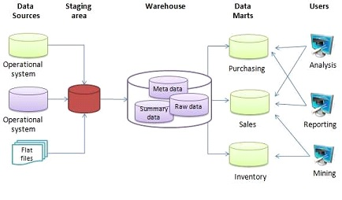
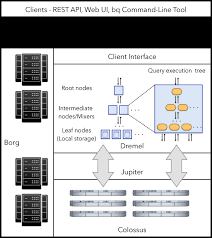

# Week 3 - Data Warehouse

### Table of contents

1. [Data warehouse and Bigquery](#part-1)
2. [Partitioning and clustering in BQ](#part-2)
3. [Bigquery - best practices](#part-3)
4. [Internal of Bigquery](#part-4)
5. [Machine Learning in BQ](#part-5)

## Part 1: Data warehouse and Bigquery <a id=part-1></a>

### OLAP vs. OLTP

|                     |                                                OLTP                                               |                                        OLAP                                       |
|:-------------------:|:-------------------------------------------------------------------------------------------------:|:---------------------------------------------------------------------------------:|
| Purpose             | Control and run essential business operations in real time                                        | Plan, solve problems, support decisions, discover hidden insights                 |
| Data updates        | Short, fast updates initiated by user                                                             | Data periodically refreshed with scheduled, long-running batch jobs               |
| Database design     | Normalized databases for efficiency                                                               | Denormalized databases for analysis                                               |
| Space requirements  | Generally small if historical data is archived                                                    | Generally large due to aggregating large datasets                                 |
| Backup and recovery | Regular backups required to ensure business continuity and meet legal and governance requirements | Lost data can be reloaded from OLTP database as needed in lieu of regular backups |
| Productivity        | Increases productivity of end users                                                               | Increases productivity of business managers, data analysts, and executives        |
| Data view           | Lists day-to-day business transactions                                                            | Multi-dimensional view of enterprise data                                         |
| User examples       | Customer-facing personnel, clerks, online shoppers                                                | Knowledge workers such as data analysts, business analysts, and executives        |

### What is Data Warehouse?

+ An OLAP solution.
+ Used for data analysis and reporting.


### Google Bigquery

+ Serverless data warehouse
  + There are no servers to manage or database software to install
+ Storage for petabytes of analytic data.
+ Software as well as infrastructure including
  + **scalability** and **high-availability**
+ Built-in features like
  + machine learning
  + geospatial analysis
  + business intelligence
+ BigQuery maximizes flexibility by separating the compute engine that analyzes your data from your storage

+ Functionalities:
  + Cache query.
  + Public datasets avaliable.
  + Save result to dataset or external sources (GCS storage, etc.)

+ Bigquery Cost:
  + On-demand pricing.
  + Flat rate pricing.
    + Based on number of requested slots.
    + 100 slots = $2000 = 400 TB data processed on demand pricing.

### Perform basic queries on Bigquery

+ Query public available table:

    ```sql
    SELECT station_id, name 
    FROM
        bigquery-public-data.new_york_citibike.citibike_stations
    LIMIT 100;
    ```

+ Creating external table referring to gcs path

    ```sql
    CREATE OR REPLACE EXTERNAL TABLE `taxi-rides-ny.nytaxi.external_yellow_tripdata`
    OPTIONS (
        format = 'CSV',
        uris = ['gs://nyc-tl-data/trip data/yellow_tripdata_2019-*.csv', 'gs://nyc-tl-data/trip data/yellow_tripdata_2020-*.csv']
    );
    ```

+ Check yello trip data:

    ```sql
    SELECT * 
    FROM taxi-rides-ny.nytaxi.external_yellow_tripdata 
    LIMIT 10;
    ```

### Partition in BQ

+ Reduce cost when performing queries that do not want to scan the whole dataset but just a few partitions.
+ Create a **non-partitioned** table from external table:

    ```sql
    CREATE OR REPLACE TABLE taxi-rides-ny.nytaxi.yellow_tripdata_non_partitoned AS
    SELECT * 
    FROM taxi-rides-ny.nytaxi.external_yellow_tripdata;
    ```

+ Create a **partitioned** table from external table:

    ```sql
    CREATE OR REPLACE TABLE taxi-rides-ny.nytaxi.yellow_tripdata_partitoned
    PARTITION BY
        DATE(tpep_pickup_datetime) 
    AS
    SELECT * 
    FROM taxi-rides-ny.nytaxi.external_yellow_tripdata;
    ```

+ Impact of **partition** technique:

  + No partition -> Scan 1.6 GB of data:

    ```sql
    SELECT DISTINCT(VendorID)
    FROM taxi-rides-ny.nytaxi.yellow_tripdata_non_partitoned
    WHERE DATE(tpep_pickup_datetime) BETWEEN '2019-06-01' AND '2019-06-30';
    ```

  + With partition -> Scan 106 MB of data:

    ```sql
    SELECT DISTINCT(VendorID)
    FROM taxi-rides-ny.nytaxi.yellow_tripdata_partitoned
    WHERE DATE(tpep_pickup_datetime) BETWEEN '2019-06-01' AND '2019-06-30';
    ```

+ Let's look into the partitons

    ```sql
    SELECT table_name, partition_id, total_rows
    FROM `nytaxi.INFORMATION_SCHEMA.PARTITIONS`
    WHERE table_name = 'yellow_tripdata_partitoned'
    ORDER BY total_rows DESC;
    ```

### Clustering in BQ

+ Data is arranged and sorted so that similar values are grouped together.

+ Reduce cost and improve query performance (esp. when filtering in WHERE clause)

+ Create a ****partitioned** and **clustered** table:

    ```sql
    CREATE OR REPLACE TABLE taxi-rides-ny.nytaxi.yellow_tripdata_partitoned_clustered
    PARTITION BY DATE(tpep_pickup_datetime)
    CLUSTER BY VendorID 
    AS
    SELECT * 
    FROM taxi-rides-ny.nytaxi.external_yellow_tripdata;
    ```

    

+ Query improvement:
  + With parition and **NO** clustering -> Query scans 1.1 GB

    ```sql
    SELECT count(*) as trips
    FROM taxi-rides-ny.nytaxi.yellow_tripdata_partitoned
    WHERE DATE(tpep_pickup_datetime) BETWEEN '2019-06-01' AND '2020-12-31'
    AND VendorID=1;
    ```

  + With partition and **clustering** --> Query scans 864.5 MB

    ```sql
    SELECT count(*) as trips
    FROM taxi-rides-ny.nytaxi.yellow_tripdata_partitoned_clustered
    WHERE DATE(tpep_pickup_datetime) BETWEEN '2019-06-01' AND '2020-12-31'
    AND VendorID=1;
    ```

## Part 2: Partitioning and Clustering in BQ<a id=part-2></a>

### Partitioning

+ What data is typically to partition:
  + Time-unit column
  + Ingestion time (_PARTITIONTIME)
  + Integer range partition
  + When using time unit or ingestion time:
    + Hourly
    + Daily
    + Monthly or yearly
  + Number of partition limit is 400

### Clustering

+ Columns you specify are used to colocate related data
+ Order of the column is important
T+ he order of the specified columns determines the sort order of the data.
  + Clustering improves
  + Filter queries
  + Aggregate queries
+ Table with data size < 1 GB, don’t show significant improvement with partitioning and clustering
+ You can specify up to 4 clustering columns.

+ Clustering columns must be top-level, non-repeated columns
  + DATE
  + BOOL
  + GEOGRAPHY
  + INT64
  + NUMERIC
  + BIGNUMERIC
  + STRING
  + TIMESTAMP
  + DATETIME

### Comparison

| Clustering                                                                           | Partitoning                          |
|--------------------------------------------------------------------------------------|--------------------------------------|
| Cost benefit unknown                                                                 | Cost known upfront                   |
| You need more granularity than partitioning alone allows                             | You need partition-level management. |
| Your queries commonly use filters or aggregation against multiple particular columns | Filter or aggregate on single column |
| The cardinality of the number of values in a column or group of columns is large     |                                      |

### Clustering over partitioning

+ Partitioning results in a small amount of data per partition (approximately less than 1 GB)
+ Partitioning results in a large number of partitions beyond the limits on partitioned tables
+ Partitioning results in your mutation operations modifying the majority of partitions in the table frequently (for example, every few minutes)

### Automatic Re-clustering

+ As data is added to a clustered table the newly inserted data can be written to blocks that contain key ranges that overlap with the key ranges in previously written blocks
+ These overlapping keys weaken the sort property of the table
+ To maintain the performance characteristics of a clustered table
+ BigQuery performs automatic re-clustering in the background to restore the sort property of the table
+ For partitioned tables, clustering is maintained for data within the scope of each partition.

## Part 3: Bigquery Best - practices <a id=part-3></a>

### Cost reduction

+ Avoid SELECT *
+ Price your queries before running them
+ Use clustered or partitioned tables
+ Use streaming inserts with caution
+ Materialize query results in stages

### Query performance

+ Filter on partitioned columns
+ Denormalizing data
+ Use nested or repeated columns
+ Use external data sources appropriately
+ Don't use it, in case u want a high query performance
+ Reduce data before using a JOIN
+ Do not treat WITH clauses as prepared statements
+ Avoid oversharding tables

## Part 4: Internal of Bigquery <a id=part-4></a>

### Bigquery high-level structure



+ Data is stored in column-oriented format

+ References:
  + <https://cloud.google.com/bigquery/docs/how-to>
  + <https://research.google/pubs/pub36632/>
  + <https://panoply.io/data-warehouse-guide/bigquery-architecture/>
  + <http://www.goldsborough.me/distributed-systems/2019/05/18/21-09-00-a_look_at_dremel/>

## Part 5: Machine Learning in BQ <a id=part-5></a>

+ ML in Bigquery:
  + Target audience Data analysts, managers
  + No need for Python or Java knowledge
  + No need to export data into a different system

+ Free:
  + 10 GB per month of data storage
  + 1 TB per month of queries processed
  + ML Create model step: First 10 GB per month is free

### Machine learning basic queries in BQ (example case)

+ SELECT THE COLUMNS INTERESTED FOR YOU:

    ```sql
    SELECT passenger_count, trip_distance, PULocationID, DOLocationID, payment_type, fare_amount, tolls_amount, tip_amount
    FROM `taxi-rides-ny.nytaxi.yellow_tripdata_partitoned` WHERE fare_amount != 0;
    ```

+ CREATE A ML TABLE WITH APPROPRIATE TYPE

    ```sql
    CREATE OR REPLACE TABLE `taxi-rides-ny.nytaxi.yellow_tripdata_ml` (
    `passenger_count` INTEGER,
    `trip_distance` FLOAT64,
    `PULocationID` STRING,
    `DOLocationID` STRING,
    `payment_type` STRING,
    `fare_amount` FLOAT64,
    `tolls_amount` FLOAT64,
    `tip_amount` FLOAT64
    ) AS (
    SELECT passenger_count, trip_distance, cast(PULocationID AS STRING), CAST(DOLocationID AS STRING),
    CAST(payment_type AS STRING), fare_amount, tolls_amount, tip_amount
    FROM `taxi-rides-ny.nytaxi.yellow_tripdata_partitoned` WHERE fare_amount != 0
    );
    ```

+ CREATE MODEL WITH DEFAULT SETTING

    ```sql
    CREATE OR REPLACE MODEL `taxi-rides-ny.nytaxi.tip_model`
    OPTIONS
    (model_type='linear_reg',
    input_label_cols=['tip_amount'],
    DATA_SPLIT_METHOD='AUTO_SPLIT') AS
    SELECT
    *
    FROM
    `taxi-rides-ny.nytaxi.yellow_tripdata_ml`
    WHERE
    tip_amount IS NOT NULL;
    ```

+ CHECK FEATURES

    ```sql
    SELECT * FROM ML.FEATURE_INFO(MODEL `taxi-rides-ny.nytaxi.tip_model`);
    ```

+ EVALUATE THE MODEL

    ```sql
    SELECT *
    FROM
        ML.EVALUATE(
            MODEL `taxi-rides-ny.nytaxi.tip_model`,(
            SELECT *
            FROM `taxi-rides-ny.nytaxi.yellow_tripdata_ml`
            WHERE tip_amount IS NOT NULL));
    ```

+ PREDICT THE MODEL

    ```sql
    SELECT *
    FROM
        ML.PREDICT(
            MODEL `taxi-rides-ny.nytaxi.tip_model`,
            (SELECT *
            FROM `taxi-rides-ny.nytaxi.yellow_tripdata_ml`
            WHERE tip_amount IS NOT NULL
            ));
    ```

+ PREDICT AND EXPLAIN

    ```sql
    SELECT *
    FROM
        ML.EXPLAIN_PREDICT(MODEL `taxi-rides-ny.nytaxi.tip_model`,
        (
            SELECT * 
            FROM `taxi-rides-ny.nytaxi.yellow_tripdata_ml`
            WHERE tip_amount IS NOT NULL), 
        STRUCT(3 as top_k_features)
        );
    ```

+ HYPER PARAM TUNNING

    ```sql
    CREATE OR REPLACE MODEL `taxi-rides-ny.nytaxi.tip_hyperparam_model`
    OPTIONS (
        model_type='linear_reg',
        input_label_cols=['tip_amount'],
        DATA_SPLIT_METHOD='AUTO_SPLIT',
        num_trials=5,
        max_parallel_trials=2,
        l1_reg=hparam_range(0, 20),
        l2_reg=hparam_candidates([0, 0.1, 1, 10])
    ) AS
    SELECT *
    FROM `taxi-rides-ny.nytaxi.yellow_tripdata_ml`
    WHERE tip_amount IS NOT NULL;
    ```
