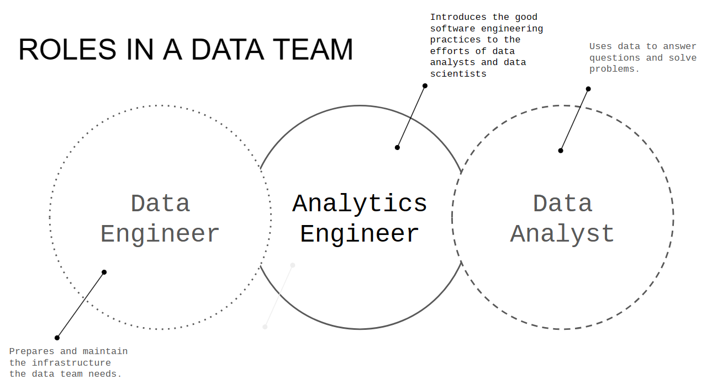
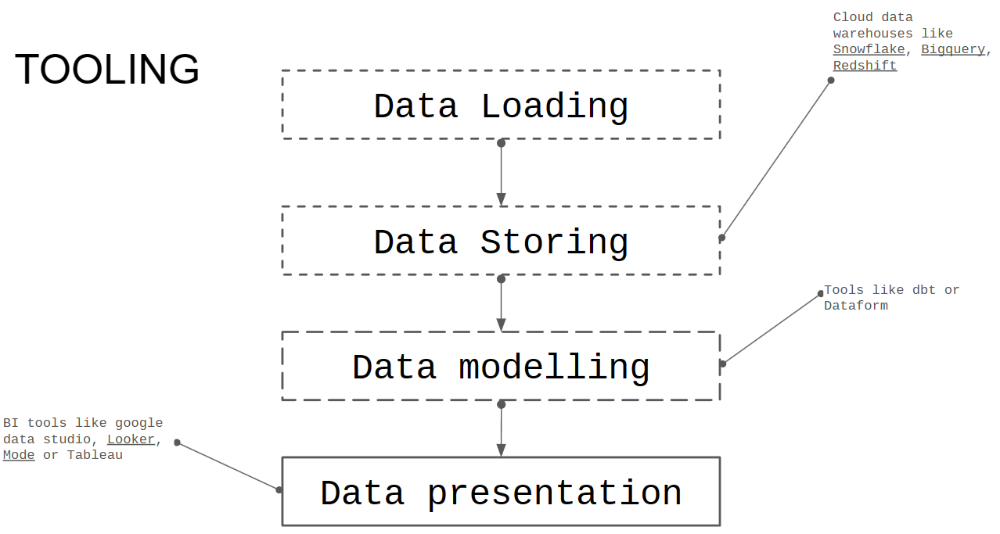
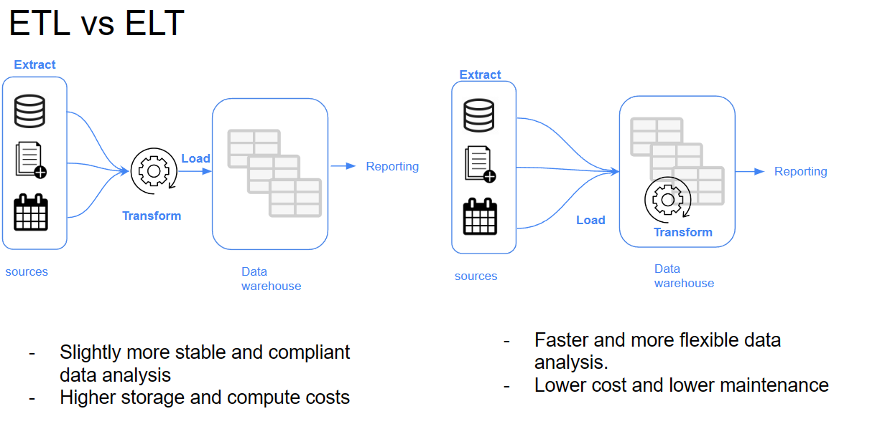
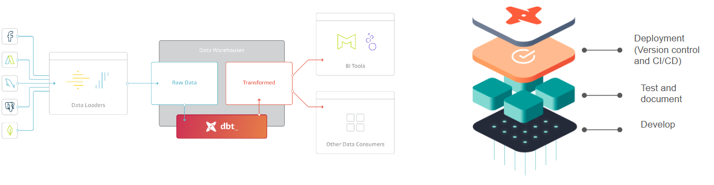
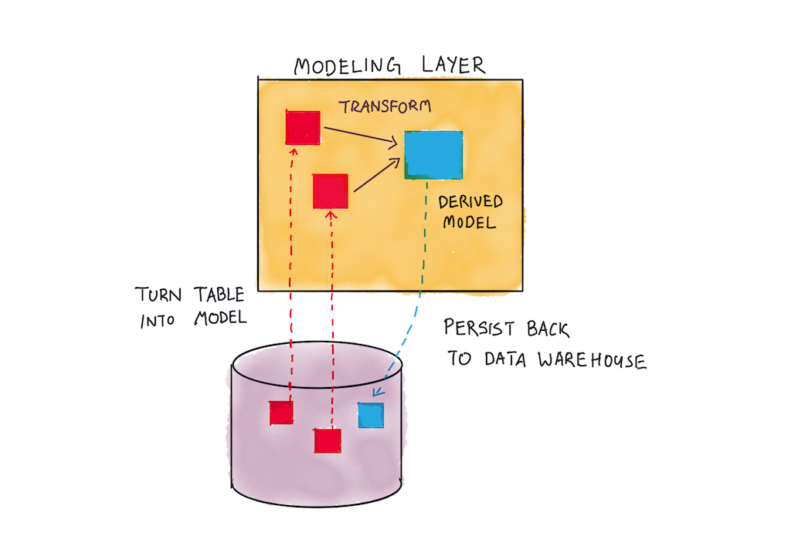
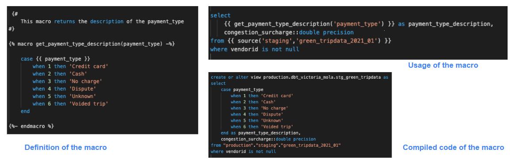
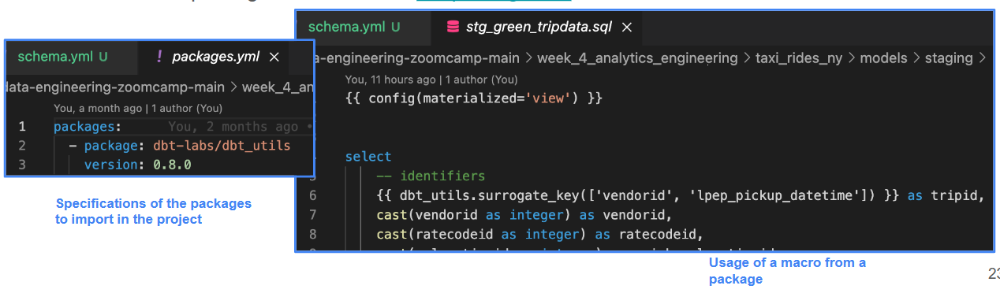
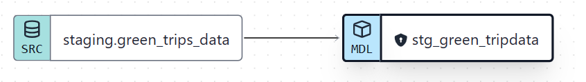
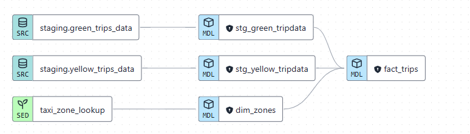

# Week 4 - Analytics Engineering

### Table of Contents

1. [Analytics engineering basics](#part-1)
2. [Start a dbt project (cloud)](#part-2)
3. [Testing and Documentation in dbt project](#part-3)
4. [Deployment for a dbt Cloud project](#part-4)
5. [Visualizing data with Google Data Studio](#part-5)

## Part 1: Analytics engineering basics <a id=part-1></a>

+ **What is analytics engineering?**
  + Analytics engineer has a combination skill of **data engineer** and **data analyst**.
    

  + Tooling:
    

+ Data modeling concept:
  + ETL vs. ELT:
    

  + Kimball's dimensional modeling:
    + **Objective**:
      + Deliver data understandable to the business users
      + Deliver fast query performance.
    + **Approach**:
      + Prioritise user understanablity and query performance over non redudant data (3NF).
      + Bill Imon approach.
      + Data vault.
  
  + Elements of Dimensional modeling:
    + **Facts table**:
      + Measurements, metrics or facts.
      + Corresponds to a business process.
      + "verbs"
    + **Dimensions table**:
      + Correspond to a business *entity*.
      + Provides context to a business process.
      + "nouns*
  
  + Architecture of Dimension modeling:
    + **Stage area**:
      + Contain raw data.
      + Not meant to be exposed to everyone.
    + **Processing area**:
      + From raw data to data model.
      + Focuses in efficiency.
      + Ensuring standards.
    + **Presentation area**:
      + Final presentation of data
      + Exposure to stakeholders.

+ Tool for analytic engineering: **dbt**
  + dbt is a transformation tool that allows anyone that knows SQL to deploy analytics code following software engineering best practices like modularity, portability, CI/CD, and documentation. 
  

  + How dbt works? 
    + Each model:
      + A *.sql file
      + SELECT statement, no DDL or DML.
      + A file that dbt will compile and run in our DWH.
    
    

  
  + How to use dbt?  

    | dbt Core                                                       | dbt Cloud                                              |
    |----------------------------------------------------------------|--------------------------------------------------------|
    | Open-source project that allows the data transformation        | SaaS application to develop and manage dbt projects.   |
    |  Builds and runs a dbt project (.sql and .yml files)          |  Web-based IDE to develop, run and test a dbt project |
    |  Includes SQL compilation logic, macros and database adapters |  Jobs orchestration                                   |
    |  Includes a CLI interface to run dbt commands locally         |  Logging and Alerting                                 |
    |  Opens source and free to use                                 |  Integrated documentation                             |
    |                                                                |  Free for individuals (one developer seat)            |

  + How are we going to use dbt?
    + For BigQuery:
      + Development using cloud IDE.
      + No local installation of dbt core/
    
    + For Postgres:
      + Development using a local IDE of your choice.
      + Local installation of dbt core connecting to the Postgres database
      + Running dbt models through the CLI

## Part 2: Start a dbt project <a id=part-1></a>

### Anatomy of dbt model

+ dbt use **Jinja** syntax for defining things. Common syntax is ```{{ ... }}```

+ dbt will compile the Jinja code into SQL code and run the code in the Data Warehouse.

+ The **FROM** clause: 

  + **Sources**:
    + The data loaded to our dwh that we use as sources for our models
    + Configuration defined in the yml files in the models folder
    + Used with the source macro that will resolve the name to the right schema, plus build the dependencies automatically 
    + Source freshness can be defined and tested
    + Example: 
    ```yaml
    source: 
      - name: staging
        database: production
        schema: trip_data_all

        loaded_at_field: record_loaded_at

        tables:
          - name: green_tripdata
          - name: yellow_tripdata
            freshness:
              error_afters: {count: 6, period: hour}
    ```
    Then in dbt model
    ```sql
    ...
    from {{ source('staging', 'yellow_tripdata_2021_01' )}}
    ...
    ```

  + **Seeds**:
    + CSV files stored in our repository under the seed folder
    + Benefits of version controlling 
    + Equivalent to a copy command
    + Recommended for data that doesn't change frequently
    + Runs with ```dbt seed -s file_name``````
    + Example: 
    ```sql
    select
    ...
    from {{ ref("taxi_zone_lookup") }}
    ...
    ```
  
  + **Refs**:
    + Macro to reference  the underlying tables and views that were building the data warehouse
    + Run the same code in any environment, it will resolve the correct schema for you
    + Dependencies are built automatically
    + Example: 
      + In dbt model: 
      ```sql
      with green_data as (
        select *,
          'Green' as service_type 
        from {{ ref('stg_green_data') }}
      ),
      ```
      + Compiled code: 
      ```sql
      with green_data as (
        select *,
          'Green' as service_type 
        from "production"."dbt_victoria_mola"."stg_green_tripdata"
      ),
      ```
+ The **MACRO**: 
  + Use control structures (e.g. if statements and for loops) in SQL 
  + Use environment variables in your dbt project for production  deployments 
  + Operate on the results of one query to generate another query 
  + Abstract snippets of SQL into reusable macros — these are  analogous to functions in most programming languages.
  
  

+ **Packages**:
  + Like libraries in other programming languages
  + Standalone dbt projects, with models and macros that tackle a specific problem area.
  + By adding a package to your project, the package's models and macros will become part of your own project.
  + Imported in the packages.yml file and imported by running dbt deps
  + A list of useful packages can be find in dbt [package hub](https://hub.getdbt.com/).

  

+ **Variables**:
  + Variables are useful for defining values that should be used across the project
  + With a macro, dbt allows us to provide data to models for compilation
  + To use a variable we use the ```{{ var('...') }}``` function
  + Variables can defined in two ways:
    + In the dbt_project.yml file
    + On the command line
  


### Start a dbt project

+ Go to https://cloud.getdbt.com/
  + Create an account
  + Link account to Github repositories.
  + Go to **Develop** and create a new **environment**.

+ Press **Initiialize a dbt project**

+ Edit file **dbt_project.yml**:
  + Name your project: *ny_taxi_rides*
  + Name your model: *ny_taxi_rides*

+ Let's define the 1st **staging models**. 

+ Create 2 subfolders *core* and *staging* in folder *model*.

+ First, we define the **source** schema: Create a new file **schema.yml** under ```model/staging```. Define the source: 
  ```yaml
  version: 2

  sources: 
    - name: staging
      database: nda-de-zoomcamp  # database name in BQ
      schema: ny_taxi_trips   # dataset name in BQ

      tables:
        - name: green_trips_data    # table name in BQ
        - name: yellow_tripdata
  ```

  + Create a new file **stg_green_tripdata.sql** in ```model/staging```:
  ```sql
  {{ config(materialized='view') }}

  select * from {{ source('staging', 'green_trips_data') }}
  limit 100
  ```
  + The lineage will be compiled as:  

  

  + Press **Build** to build the model.

  + Press **Run** to run the model.

  + dbt will create the table view inside the database of Bigquery.

+ Create the **macro**:
  + Create the ```get_payment_type_description.sql``` in ```macros``` folder:
    ```sql
    {#
        This macro returns the description of the payment_type 
    #}

    

        case {{ payment_type }}
            when 1 then 'Credit card'
            when 2 then 'Cash'
            when 3 then 'No charge'
            when 4 then 'Dispute'
            when 5 then 'Unknown'
            when 6 then 'Voided trip'
        end

    
    ```
  
  + Call the macro:
    ```sql
    select
    ...
    {{ get_payment_type_description('payment_type') }} as payment_type_description, 
    ...
    from ...
    ```

+ Import and utilize external package:
  + Create a file ``packages.yml`` in the project root folder.
  + Define the external package to import:
    ```yaml
    packages:
    - package: dbt-labs/dbt_utils
      version: 0.8.0
    ```
  + Run command ```dbt deps``` to download packages and dependencies.
  + Use the package's macro to create a new column for surrogate key:
    ```sql
    select 
    {{ dbt_utils.surrogate_key(['vendorid', 'lpep_pickup_datetime']) }} as tripid,
    ...
    from ...
    ```

+ Add a variable to check whether this is a test run or full run to set query row limit.

  ```sql
  from ...
  

    limit 100

  
  ```

  + Run the model with variable:  
  ```dbt run --select stg_green_tripdata --var 'is_test_run:false'```

+ Apply above steps to create 2nd model for ```yellow_tripdata``` (change the source in FROM clause).

+ Create a **seed** for the static CSV file, this will be used as the dimension table.
  + Locate the folder *seeds*.
  + Create a file ```taxi_zone_lookup.csv``` and upload the content.
  + Define the seed in ```dbt_project.yml```:
    ```yaml
    ...
    seeds:
      ny_taxi_rides:
        taxi_zone_lookup:
          + column_types:
            location_id: numeric
    ```
  + Run ```dbt seed --full-refresh``` to build the seed with full refresh the file.

+ Create the subfolder **models/core** for the core models:
+ Create the **Dim** model: create file ```dim_zones.sql``` under ```models/core```:
  ```sql
  {{ config(materialized='view') }}

  select 
      location_id,
      borough,
      zone,
      replace(service_zone, 'Boro', 'Green') as service_zone
  from {{ ref("taxi_zone_lookup") }}
  ```
+ Create the **Fact** model: create file ```fact_trip.sql``` under ```models/core```:
  ```sql
  {{ config(materialized='table') }}

  with green_data as (
      select *, 
          'Green' as service_type 
      from {{ ref('stg_green_tripdata') }}
  ), 

  yellow_data as (
      select *, 
          'Yellow' as service_type
      from {{ ref('stg_yellow_tripdata') }}
  ), 

  trips_unioned as (
      select * from green_data
      union all
      select * from yellow_data
  ), 

  dim_zones as (
      select * from {{ ref('dim_zones') }}
      where borough != 'Unknown'
  )
  select 
      trips_unioned.tripid, 
      trips_unioned.vendorid, 
      trips_unioned.service_type,
      trips_unioned.ratecodeid, 
      trips_unioned.pickup_locationid, 
      pickup_zone.borough as pickup_borough, 
      pickup_zone.zone as pickup_zone, 
      trips_unioned.dropoff_locationid,
      dropoff_zone.borough as dropoff_borough, 
      dropoff_zone.zone as dropoff_zone,  
      trips_unioned.pickup_datetime, 
      trips_unioned.dropoff_datetime, 
      trips_unioned.store_and_fwd_flag, 
      trips_unioned.passenger_count, 
      trips_unioned.trip_distance, 
      trips_unioned.trip_type, 
      trips_unioned.fare_amount, 
      trips_unioned.extra, 
      trips_unioned.mta_tax, 
      trips_unioned.tip_amount, 
      trips_unioned.tolls_amount, 
      trips_unioned.ehail_fee, 
      trips_unioned.improvement_surcharge, 
      trips_unioned.total_amount, 
      trips_unioned.payment_type, 
      trips_unioned.payment_type_description, 
      trips_unioned.congestion_surcharge
  from trips_unioned
  inner join dim_zones as pickup_zone
  on trips_unioned.pickup_locationid = pickup_zone.locationid
  inner join dim_zones as dropoff_zone
  on trips_unioned.dropoff_locationid = dropoff_zone.locationid
  ```

  + The lineage will look like:
  
  

+ Run the model by pressing ```Run``` or command ```dbt run```.
  + This option will NOT build the seeds & tests.

+ Build the model by pressing ```Build``` or command ```dbt build```.
  + This option will build everything (including seeds & tests).

+ We can use command ```dbt build --select +fact_trips``` to build the *fact_trip* model including all its dependencies with the '+' macro.

## Part 3: Testing and documentation in dbt project <a id=part-3></a>

### Testing:
+ Assumptions that we make about our data 
+ Tests in dbt are essentially a select sql query
+ These assumptions get compiled to sql that returns the amount of failing records
+ Test are defined on a column in the .yml file
+ dbt provides basic tests to check if the column values are:
  + Unique
  + Not null 
  + Accepted values
  + A foreign key to another table
+ You can create your custom tests as queries

+ **Apply to project:**  
  + Define in ```models/staging/schema.yml```
  + Test for primary key: 
    ```yaml
    models:
      - name: stg_green_tripdata
        columns:
          - name: tripid
            description: Primary key for this table, generated with a concatenation of vendorid+pickup_datetime
            tests:
                - unique:
                    severity: warn
                - not_null:
                    severity: warn
        .....
    ```
    + ```warn``` is to print warning at build
    + ```never``` is to stop the build and the dependencies.
  
  + Test for foreign key:
    ```yaml
    - name: Pickup_locationid
        description: locationid where the meter was engaged.
        tests:
          - relationships:
              to: ref('taxi_zone_lookup')
              field: locationid
              severity: warn
    ```
  
  + Test with variables:
    ```yml
    - name: Payment_type 
      description: >
        A numeric code signifying how the passenger paid for the trip.
      tests: 
        - accepted_values:
            values: "{{ var('payment_type_values') }}"
            severity: warn
            quote: false
    ```
    + Define variables in ```dbt_project.yml```:
      ```yml
      vars:
        payment_type_values: [1, 2, 3, 4, 5, 6]
      ```
  + To run test: use command ```dbt test``` or ```dbt build```

### Documentation: 

+ dbt provides a way to generate documentation for your dbt project and *render it as a website.*
+ The documentation for your project includes:
  + Information about your project: 
    + Model code (both from the .sql file and compiled)
    + Model dependencies
    + Sources
    + Auto generated DAG from the ref and source macros
    + Descriptions (from .yml file) and tests 
  + Information about your data warehouse (information_schema):
    + Column names and data types
    + Table stats like size and rows
    + dbt docs can also be hosted in dbt cloud

+ **Apply to project**:
  + In ```models/staging/schema.yml```, at attribute ```description``` for the model and its columns:
    ```yml
    models:
      - name: stg_green_tripdata
        description: >
          Trip made by green taxis, also known as boro taxis and street-hail liveries.
          ....
        columns:
          - name: tripid
            description: Primary key for this table....
    ```
    + Use ```>``` for multi-line documentation.

## Part 4: Deployment for a dbt Cloud project <a id=part-4></a>

### Deployment:

+ Process of running the models we created in our development environment in a production environment
+ Development and later deployment allows us to continue building models and testing them without affecting our production environment
+ A deployment environment will normally have a different schema in our data warehouse and ideally a different user
+ A **development - deployment** workflow will be something like: 
  + Develop in a user branch
  + Open a PR to merge into the main branch 
  + Merge the branch to the main branch
  + Run the new models in the production environment using the main branch 
  + Schedule the models

### Running dbt project in production:

+ dbt cloud includes a **scheduler** where to create jobs to run in production
+ A single job can run multiple commands
+ Jobs can be triggered manually or on schedule
+ Each job will keep a log of the runs over time
+ Each run will have the logs for each command
+ A job could also generate documentation, that could be viewed under the run information
+ If dbt source freshness was run, the results can also be viewed at the end of a job

### Continous Integration (CI):

+ CI is the practice of regularly merge development branches into a central repository, after which automated builds and tests are run. 
+ The goal is to reduce adding bugs to the production code and maintain a more stable project. 
+ dbt allows us to enable CI on Pull Requests (PR).
+ Enabled via *webhooks* from GitHub or GitLab
+ When a PR is ready to be merged, a webhooks is received in dbt Cloud that will enqueue a new run of the specified job. 
+ The run of the CI job will be against a temporary schema 
+ No PR will be able to be merged unless the run has been completed successfully

### Apply to our project

+ First, go to ```Deploy``` --> ```Environments``` then create a new environment with environment type as *Deployment* and deployment type as *Production*.
  + Name the production database: *production*.

+ **Job**: go to Create a new job for the deployment environment. Settings: 
  + Job name: dbt build job
  + Environment: select the created deployment environment.
  + Commands: 
    + ```dbt seed```
    + ```dbt run```
    + ```dbt test```
    + Enable *Generate docs on run*.
  + Schedule: add your choice of schedule (everyday, every 6 hour, etc...)

  + Click ```Run now``` to manually trigger the job run.
    + At the job run, you can Click **View** document to see the generated documentation
  

## Part 5: Visualizing data with Google Data Studio <a id=part-5></a>

(tbd)